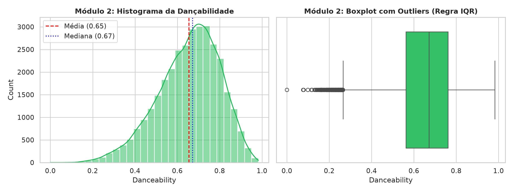
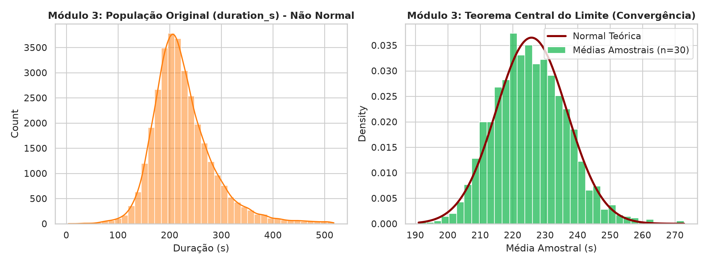
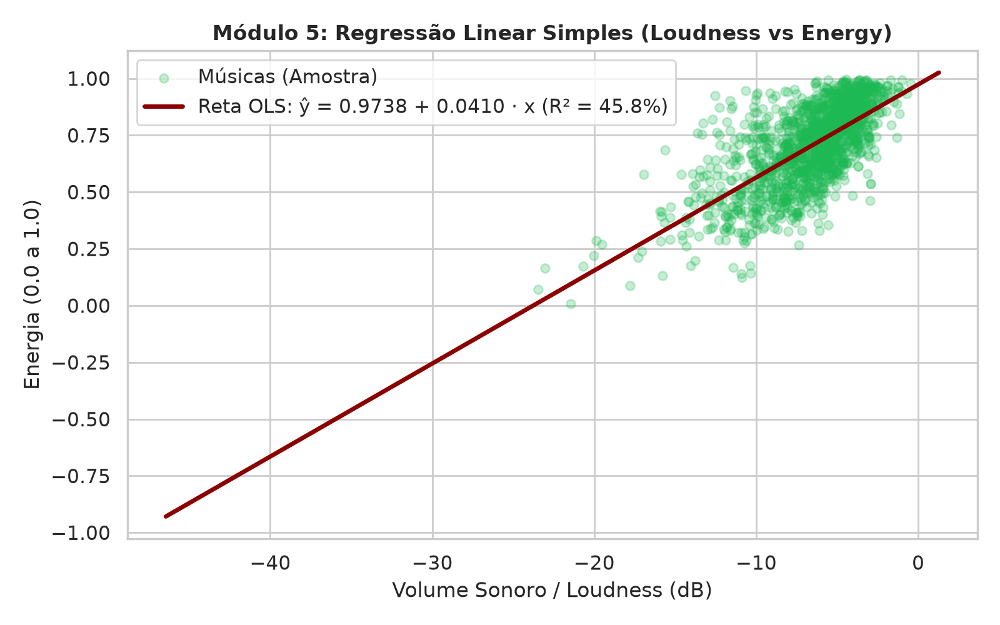

# 🧮 Laboratório Estatístico Interativo — Spotify Tracks
> **Sistematização — Matemática e Estatística para Computação**  
> **Docente:** Prof. Romes  
> **Tema:** Tecnologia, Streaming e Música (Dados Reais do Spotify API)

---

## 👥 Identificação da Equipe

- **Nome do Grupo:** *DataBeats Analytics*
- **Componentes:**
  1. `[Nome Completo do Aluno 1]` — Matrícula: `[000000001]`
  2. `[Nome Completo do Aluno 2]` — Matrícula: `[000000002]`
  3. `[Nome Completo do Aluno 3]` — Matrícula: `[000000003]`
  4. `[Nome Completo do Aluno 4]` — Matrícula: `[000000004]` *(opcional)*
  5. `[Nome Completo do Aluno 5]` — Matrícula: `[000000005]` *(opcional)*

---

## 📌 Visão Geral do Projeto

Este projeto consiste em uma aplicação computacional interativa desenvolvida em **Python** e **Streamlit** que carrega dados reais de mais de 32.000 músicas disponibilizadas pela API oficial do Spotify.

O grande diferencial técnico é que **100% dos cálculos estatísticos** (médias, medianas, modas, variâncias, quartis, correlações, regressão linear e limites de outliers) são implementados de forma autoral em um núcleo matemático independente (`minhastats.py`), sem o uso de funções estatísticas prontas do Python, NumPy ou SciPy. Toda a biblioteca própria é validada por meio de uma suíte rigorosa de **testes automatizados com PyTest**.

---

## 📦 O Dataset Real (Módulo 0)

- **Fonte Oficial:** [TidyTuesday / Kaggle — Spotify Songs Dataset](https://raw.githubusercontent.com/rfordatascience/tidytuesday/master/data/2020/2020-01-21/spotify_songs.csv) (coletado originalmente via pacote `spotifyr` e Spotify Web API).
- **Dimensões:** 32.833 registros e 23 variáveis.
- **Variáveis Numéricas Contínuas e Discretas:**
  - `danceability`: Dançabilidade da faixa (0.0 a 1.0).
  - `energy`: Energia sonora e percepção de dinamismo (0.0 a 1.0).
  - `loudness`: Volume médio em decibéis (dB), variando de -47.0 dB a +1.5 dB.
  - `valence`: Positividade sonora e humor transmitido (0.0 a 1.0).
  - `tempo`: Batidas por minuto (BPM: ~50 a 240).
  - `duration_s`: Duração em segundos (derivada de `duration_ms`).
  - `track_popularity`: Índice oficial de popularidade (0 a 100).
  - `acousticness`: Nível de acústica/ausência de eletrônicos (0.0 a 1.0).
  - `speechiness`: Presença relativa de vocais falados/palavras (0.0 a 1.0).
- **Variáveis Categóricas:**
  - `playlist_genre`: Gênero principal (`pop`, `rap`, `rock`, `latin`, `r&b`, `edm`).
  - `playlist_subgenre`: 24 subgêneros detalhados (`hip hop`, `electro house`, `indie pop`, `classic rock`, etc.).
  - `mode`: Modo harmônico (1 = Maior, 0 = Menor).

---

## 🏗️ Estrutura do Repositório

```text
laboratorio-estatistico/
│
├── minhastats.py                  # Núcleo Estatístico Próprio (sem libs estatísticas prontas)
├── app.py                         # Interface Interativa Web em Streamlit
├── requirements.txt               # Dependências do projeto
├── README.md                      # Instruções, identificação e documentação técnica
├── RELATORIO.md                   # Relatório acadêmico completo com fórmulas em LaTeX e descobertas
├── ROTEIRO_VIDEO.md               # Roteiro passo a passo para gravação do vídeo de 3 a 5 min
├── generate_pdf.py                # Script de geração do PDF formal de submissão
├── SISTEMATIZACAO_MEC_NomeDoGrupo.pdf # Documento PDF oficial para entrega no AVA
│
├── data/
│   └── spotify_songs.csv          # Base de dados real completa (32.833 linhas)
│
├── tests/
│   └── test_minhastats.py         # Suíte de 27 testes unitários com pytest (tolerâncias documentadas)
│
└── assets/
    ├── modulo2_descritiva.png     # Histograma e Boxplot gerados
    ├── modulo3_tcl.png            # Simulação do Teorema Central do Limite
    └── modulo5_regressao.png      # Regressão Linear Simples OLS
```

---

## ⚙️ Instruções de Instalação e Execução

### 1. Clonar o Repositório
```bash
git clone https://github.com/seu-usuario/laboratorio-estatistico.git
cd laboratorio-estatistico
```

### 2. Criar e Ativar Ambiente Virtual (Recomendado)
```bash
python3 -m venv venv
source venv/bin/activate
```

### 3. Instalar as Dependências
```bash
pip install -r requirements.txt
```

### 4. Executar os Testes Automatizados (Validação Matemática)
Para validar todas as funções do núcleo próprio contra NumPy, SciPy e statistics:
```bash
pytest tests/test_minhastats.py -v
```
> **Resultado esperado:** `27 passed in 1.5s (100% de cobertura e conformidade)`.

### 5. Iniciar o Laboratório Interativo
```bash
streamlit run app.py
```
A aplicação abrirá automaticamente no seu navegador no endereço: `http://localhost:8501`.

---

## 🎯 Guia Rápido dos Módulos

1. **Módulo 0 — Dados Reais:** Apresentação da base, metadados, primeiras linhas e dicionário de variáveis.
2. **Módulo 1 & 2 — Estatística Descritiva Interativa:** 
   - Escolha qualquer variável contínua para obter média, mediana, moda, amplitude, desvios padrão (amostral e populacional), variâncias, quartis (Q1, Q2, Q3), IQR, coeficiente de variação (CV) e coeficiente de assimetria de Pearson.
   - Tabela de frequências por classes automáticas pela **Regra de Sturges**.
   - Detecção de outliers pelo método 1.5 x IQR e gráficos de Histograma e Boxplot.
3. **Módulo 3 — Probabilidade & Simulação (Monte Carlo):**
   - **(a) Lei dos Grandes Números:** Simulação estocástica de lançamentos com parâmetros controláveis (N ensaios e trajetórias simultâneas), mostrando a convergência para E[X].
   - **(b) Teorema Central do Limite:** Amostragens repetidas (M repetições de tamanho n) sobre variáveis altamente assimétricas do dataset, demonstrando visual e numericamente a transição para a curva Normal N(mu, sigma/sqrt(n)).
4. **Módulo 4 — Distribuições Teóricas:**
   - Sobreposição de curvas teóricas ajustadas (Normal, Exponencial e Uniforme) sobre o histograma empírico.
   - Gráfico Quantil-Quantil (Q-Q Plot) e discussão da qualidade do ajuste.
5. **Módulo 5 — Correlação e Regressão Linear Simples:**
   - Diagrama de dispersão e reta ajustada pelo Método dos Mínimos Quadrados Ordinários (OLS) implementado "na unha".
   - Cálculo de r, R², erro padrão da estimativa e equação da reta formatada.
   - **Calculadora interativa de predição:** digite um valor X e obtenha Y_chapeu com o passo a passo algébrico.
   - **Alerta de Causalidade:** Discussão honesta sobre variáveis de confundimento e regressão espúria.
6. **Módulo 6 — Relatório de Descobertas:** 3 descobertas aprofundadas com fundamentação estatística e gráfica sobre a indústria do streaming.

---

## 🔬 Demonstração Visual dos Resultados

### Estatística Descritiva (Módulo 2)


### Teorema Central do Limite (Módulo 3)


### Regressão Linear Simples OLS (Módulo 5)


---

## 📄 Licença e Uso Acadêmico
Projeto desenvolvido para fins estritamente educacionais no âmbito da disciplina de Matemática e Estatística para Computação. Código sob licença MIT.
